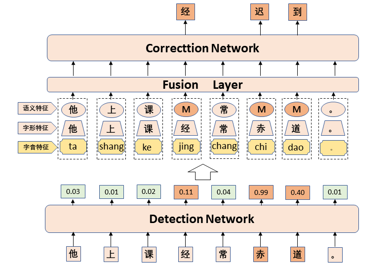
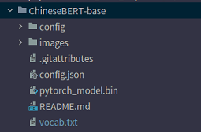

## 基于ChineseBert的中文拼写纠错方法

**摘 要 ：** 预训练语言模型（如 Bert,Roberta）用于解决中文拼写纠错取得了非常不错的结果。考虑到中文拼写
错误主要集中在拼音相似和字形相似两个方面，一些工作在预训练语言模型的基础上，利用额外的网络模型融入
拼音和字形信息。相对于直接微调预训练模型，改进后的模型提升的性能有限，主要是因为只来源于训练语料的
拼音和字形信息，与预训练语言模型获取的文本语义信息，有着巨大的信息不对等。最近，整合文本、拼音和字
形的多模态预训练语言模型吸引了广泛的关注，例如 ChineseBert。因此，该文首次研究利用 ChineseBert 解决
中文拼写纠错问题，并提出了两种不同的中文拼写纠错方法。由于 ChineseBert 已经将拼音和字形信息放到了预
训练模型构建阶段，不仅无需构建额外的网络，简化了整体模型结构，而且解决了信息不对等问题。在三个官方
评测数据集上进行评估，提出的两个方法取得了非常不错的结果。



## Environment：

- **python3.6**

- **pytorch1.7.1**

- **transformers4.6.0**


## Raw Data:

SIGHAN Bake-off 2013: http://ir.itc.ntnu.edu.tw/lre/sighan7csc.html

SIGHAN Bake-off 2014: http://ir.itc.ntnu.edu.tw/lre/clp14csc.html

SIGHAN Bake-off 2015: http://ir.itc.ntnu.edu.tw/lre/sighan8csc.html

Wang271K: https://github.com/wdimmy/Automatic-Corpus-Generation

我们使用的是论文《[Read, Listen, and See: Leveraging Multimodal Information Helps Chinese Spell Checking](https://arxiv.org/abs/2105.12306).》处理的数据

[数据]: https://drive.google.com/drive/folders/1dC09i57lobL91lEbpebDuUBS0fGz-LAk
https://drive.google.com/drive/folders/1dC09i57lobL91lEbpebDuUBS0fGz-LAk


###############################################################################
# ChineseBert方法
基于 ChineseBert 的 CSC 方法是在不添加额
外的网络的前提下，仅利用 ChineseBert 预训练
模型在 CSC 训练数据集上进行微调。
## 1.训练
运行文件夹 Finetuning_ChineseBert 下文件

```
sh train_finuting_chineseBert.sh
```

## 2.测试
运行文件夹 Finetuning_ChineseBert 下文件

```
sh test_finuting.sh
```
################################################################################
# SepSpell方法
尽管基于 ChineseBert 的 CSC 方法已经取得
了不错的结果，但由于 chineseBert 预训练语言
模型采用的是非自回归的解码方式，依赖于字符
独立性假设，导致预测输出时出现不连贯问题 。
在连续拼写错误中，这个问题表现的尤为突出。
而错误字符通常携带错误的语义信息，在解码阶
段相互干扰，导致最终模型不能正确输出。针对
这个问题，本文进行了针对性设计，提出了
SepSpell 方法。
## 1.探测模型训练：

本篇论文同样也是使用的ChineseBert作为编码器对模型进行二分类训练。

### 训练
```
sh train_detection.sh
```
### 测试  
```
sh test_detection.sh
```


## 2.校正模型训练：train_SepSpell.py

**注意：因为探测模型和校正模型训练过程完全分开的，所以，校正模型训练过程中和探测模型没有任何关系。训练好的探测模型只是放在了最终测试阶段的数据预处理阶段。**

**1、**首先下载**`ChineseBERT-base`**预训练模型。链接：https://github.com/ShannonAI/ChineseBert#Download



预训练文件放在：--model_name_or_path

2、参数 --random_mask  因为在考虑到校正模型在预测阶段看不到错误字符的位置，很大程度上只能取决于探测模型的准确率，所以我们在校正模型的训练阶段也对一些正确字符进行了屏蔽。我们给的参数是5。表示每句话都会屏蔽句子长度的1/5，20%的字符。

3、Train

```
sh train.sh
```

## 3.模型测试阶段:test_SepSpell.py

1、在模型测试阶段需要借助探测模型，需要将训练好的模型地址放到

--detection_model_name_or_path   放到这个参数位置。而探测模型的是在数据预处理阶段。在文件test_dataset.py文件中。

2、--error_value  超参数，表示探测器的阈值。本篇论文设置为0.05。表示 只要预测一个字符的错误概率大于 error_value值 则判断该字符错误。（阈值调这么低是为了提高错误字符的召回率，但是同时也无形中增加了噪音，本篇论文也提到，目前影响模型整体性能的原因还是在于探测阶段，所以本人下一步的工作也是研究如何在尽量降低模型的查准率P的前提下提高错误字符的召回率。这一点也欢迎有兴趣的伙伴和我一起探讨。）

3、重要的一点，如果想要使用自己的探测模型，只需要修改test_dataset.py文件中调用模型的那块代码即可。

```
logits = self.detection_model( input_ids=input_ids.view(1,input_shape[0]),
                               pinyin_ids=pinyin_ids.view(1,input_shape[0],8),
                               attention_mask=attention_mask.view(1,input_shape[0]))[0].squeeze()
loss_mask = self.get_lossmask(logits=logits)
```


